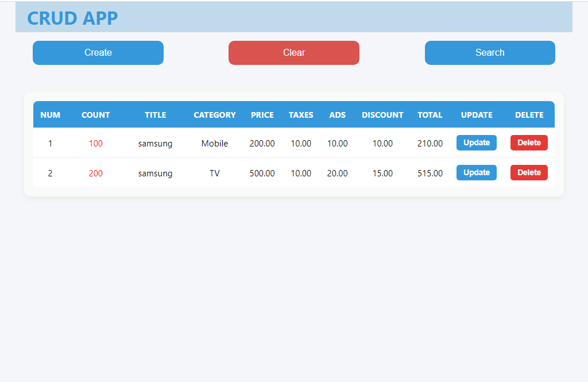
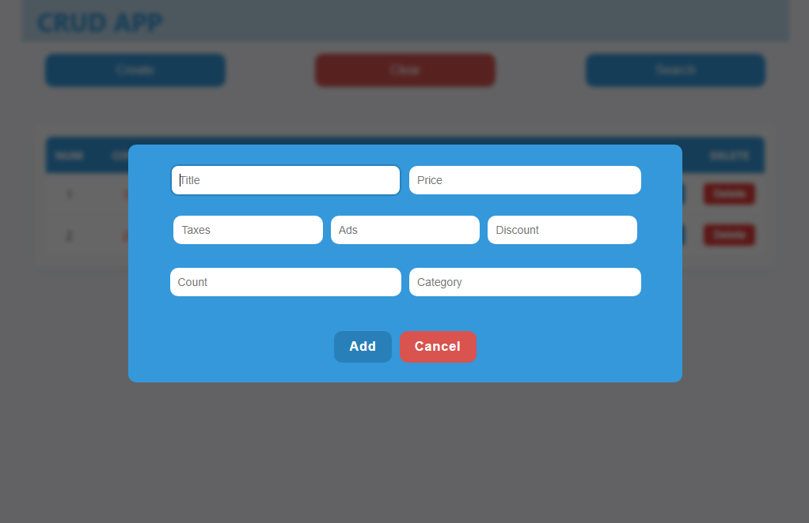

🌟 Overview
A responsive web application for managing products with full CRUD functionality, search, and filtering capabilities.

🚀 Features
Product Management:

✅ Add new products with details (name, price, taxes, discount, etc.)

## 🌐 Live Demo

[View Live Demo](https://username.github.io/product-management-system)

## 📸 Screenshots

### Main Dashboard

### Product Creation

### Search Results

📝 Edit existing products

🗑 Delete products (reduce quantity or full removal)

🧹 Clear all products at once

Data Handling:

🔍 Advanced search by product name or category

💾 Automatic saving to localStorage

🔄 Data persistence across page reloads

User Experience:

📱 Fully responsive design

⚡ Instant search results

📊 Product count tracking with visual indicators

🛠 Technical Stack
Technology Purpose
HTML5 Structure
CSS3 Styling
JavaScript (ES6+) Functionality
localStorage Data persistence
🏁 Getting Started
Prerequisites
Modern web browser (Chrome, Firefox, Edge)

Installation
Clone the repository:

git clone https://github.com/username/product-management-system.git
Open index.html in your browser

🖥 Usage Guide
Adding a Product
Click "Create" button

Fill in the form fields

Click "Submit"

Editing a Product
Click "Update" next to the product

Modify the desired fields

Click "Submit"

Deleting Products
Single click: Reduces quantity by 1

When quantity reaches 0: Complete removal

Searching
Click the search icon

Type product name or category

Results update in real-time

📊 Code Structure
project/
│── index.html # Main HTML file
│── style.css # Stylesheet
│── script.js # Main JavaScript file
│── README.md # This documentation
🔧 Key Functions
javascript
// Core functionality
function addProduct() { ... } // Adds new product
function updateProduct() { ... } // Updates existing product
function dele() { ... } // Handles product deletion
function search() { ... } // Filters products
📱 Responsive Design
Adapts to all screen sizes

Mobile-friendly interface

Accessible controls

📜 License
MIT License - Free for personal and commercial use

🤝 Contributing
Pull requests welcome! For major changes, please open an issue first.
